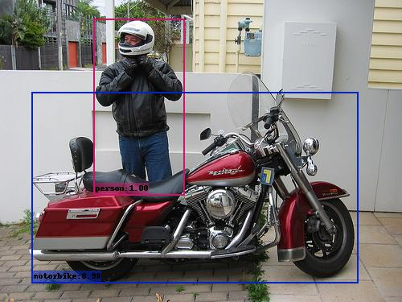

# DSSD in pytorch


This repository implements [DSSD : Deconvolutional Single Shot Detector](https://arxiv.org/abs/1512.02325). The code were borrowed heavily from [SSD](https://github.com/lufficc/SSD). The things I did was the DSSD network definition, including the **backbone of resnet101, deconvolutional module, and the prediction modules**. Code for training, distributed training, dataset loading and data augmention is the same as [lufficc's SSD](https://github.com/lufficc/SSD). Thanks [@lufficc](https://github.com/lufficc) for his great job.

It is worth mentioning that I changed the `DSSD321` to `DSSD320` and `DSSD513` to `DSSD512` to fit pytorch convolution and deconvolution modules. The mAP will not be affected at all. In fact, I get a higher mAP than paper!


<div align="center">
  
  <p>Example DSSD output (resnet101_dssd320_voc0712).</p>
</div>


## Installation
### Requirements

1. Python3
1. PyTorch 1.0 or higher
1. yacs
1. [Vizer](https://github.com/lufficc/Vizer)
1. GCC >= 4.9
1. OpenCV


### Step-by-step installation

```bash
git clone https://github.com/ZQPei/DSSD.git
cd DSSD
#Required packages
pip install -r requirements.txt

```

### Build
If your torchvision >= 0.3.0, nms build is not needed! We also provide a python-like nms, but is very slower than build-version.
```bash
# For faster inference you need to build nms, this is needed when evaluating. Only training doesn't need this.
cd ext
python build.py build_ext develop
```

## Train

### Setting Up Datasets
#### Pascal VOC

For Pascal VOC dataset, make the folder structure like this:
```
VOC_ROOT
|__ VOC2007
    |_ JPEGImages
    |_ Annotations
    |_ ImageSets
    |_ SegmentationClass
|__ VOC2012
    |_ JPEGImages
    |_ Annotations
    |_ ImageSets
    |_ SegmentationClass
|__ ...
```
Where `VOC_ROOT` default is `datasets` folder in current project, you can create symlinks to `datasets` or `export VOC_ROOT="/path/to/voc_root"`.

#### COCO

For COCO dataset, make the folder structure like this:
```
COCO_ROOT
|__ annotations
    |_ instances_valminusminival2014.json
    |_ instances_minival2014.json
    |_ instances_train2014.json
    |_ instances_val2014.json
    |_ ...
|__ train2014
    |_ <im-1-name>.jpg
    |_ ...
    |_ <im-N-name>.jpg
|__ val2014
    |_ <im-1-name>.jpg
    |_ ...
    |_ <im-N-name>.jpg
|__ ...
```
Where `COCO_ROOT` default is `datasets` folder in current project, you can create symlinks to `datasets` or `export COCO_ROOT="/path/to/coco_root"`.

### Single GPU training

```bash
# edit script file
vi scripts/resnet101_dssd320_voc0712_single_gpu.sh

# change line 2 export VOC_ROOT="/data/pzq/voc/VOCdevkit" to your path of VOC dataset.
# do the same change to the rest scripts file.

# for example, train DSSD320 on VOC:
sh scripts/resnet101_dssd320_voc0712_single_gpu.sh
```
### Multi-GPU training

```bash
# for example, train DSSD320 with 4 GPUs:
sh scripts/resnet101_dssd320_voc0712_multi_gpu.sh
```

## Evaluate

### Single GPU evaluating

```bash
# for example, evaluate DSSD320:
python test.py --config-file configs/resnet101_dssd320_voc0712.yaml
```

### Multi-GPU evaluating

```bash
# for example, evaluate DSSD320 with 4 GPUs:
export NGPUS=4
python -m torch.distributed.launch --nproc_per_node=$NGPUS test.py --config-file configs/resnet101_dssd320_voc0712.yaml
```

## Demo

Predicting image in a folder is simple:
```bash
python demo.py --config-file configs/resnet101_dssd320_voc0712.yaml --images_dir demo --ckpt [ckpt_path]
```


## Develop Guide

If you want to add your custom components, please see [DEVELOP_GUIDE.md](DEVELOP_GUIDE.md) for more details.

